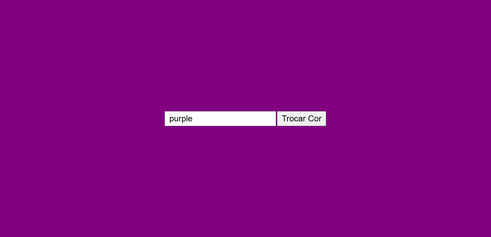

# TROCAR COR DA PÁGINA

---

## Sobre
Site informativo para demonstrar uma tabela das lojas de departamento com maiores índices de favoritismo dos clientes! O objetivo desse projeto é trocar a cor do body com javacript, durante o curso de Desenvolvimento de Sistemas do [SENAI Jandira](https://sp.senai.br/unidade/jandira/)

---

## Tecnologias Utilizadas
- HTML
- CSS
- Markdown
- Git

---

## Autor
- [Mariane Rodrigues](https://www.linkedin.com/in/mariane-rodrigues-93a02a25b/)
